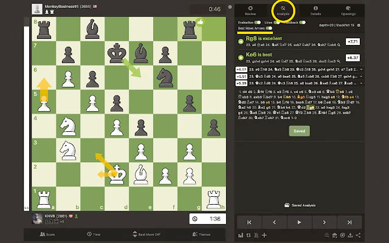

# Arrows for Chess.com

Chrome Extension that Shows Engine Line Arrows on Analysis Board on Chess.com

On the chess.com analysis board you can only see the engine lines in algebraic notation (d4, f3, ...). I made a chrome extension that visualizes the engine lines with arrows (similar to what you know from Lichess).

Download here: https://chrome.google.com/webstore/detail/arrows-for-chesscom/deaiombfofdgoldipnjjgbjkhledjhaj

Video: https://youtu.be/UDBJ1Lx8h3E

## How it works:

* Install the chrome extension
* Go to the game review of a game you've played on chess.com (https://www.chess.com/analysis/game/live/...)
* Open the analysis tab
* Enable the "Best Move Arrows"-Toggle

You should now see orange arrows that show you the best moves

